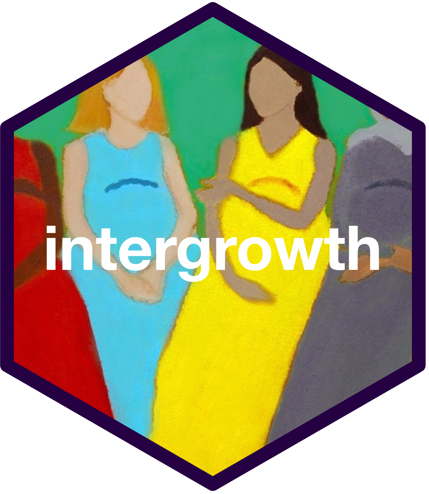

<!-- README.md is generated from README.Rmd. Please edit that file -->

```{r, include = FALSE}
knitr::opts_chunk$set(
  collapse = TRUE,
  comment = "#>",
  fig.path = "man/figures/README-",
  out.width = "100%"
)
```
# intergrowth: An R Implementation of the INTERGROWTH-21st Standards and Tools 

<!-- badges: start -->
[](https://www.tidyverse.org/lifecycle/#maturing)
[](https://travis-ci.org/nutriverse/intergrowth)
[](https://ci.appveyor.com/project/nutriverse/intergrowth)
<!-- badges: end -->

The INTERGROWTH-21st Project was a multi-centre, multi-ethnic, population-based project, conducted between 2009 and 2014, in eight demarcated urban areas: Pelotas, Brazil; Shunyi County, Beijing, China; Central Nagpur, India; Turin, Italy; Parklands Suburb, Nairobi, Kenya; Muscat, Oman; Oxford, UK, and Seattle, USA. Its primary aim was to study growth, health, nutrition and neurodevelopment from <14weeks of gestation to 2 years of age, using the same conceptual framework as the WHO Multicentre Growth Reference Study, so as to produce international prescriptive standards for pregnancy dating, maternal weight gain, fetal growth, newborn size, the postnatal growth of preterm infants and cognitive development at 2 years of age. These scientifically robust clinical tools may be used to monitor and evaluate maternal and fetal wellbeing, as well as infant health and nutrition at an individual and population level.

## Installation

You can install the released version of intergrowth from [CRAN](https://CRAN.R-project.org) with:

``` r
install.packages("intergrowth")
```

And the development version from [GitHub](https://github.com/) with:

``` r
if(!require(remotes)) install.packages("remotes")
remotes::install_github("nutriverse/intergrowth")
```
